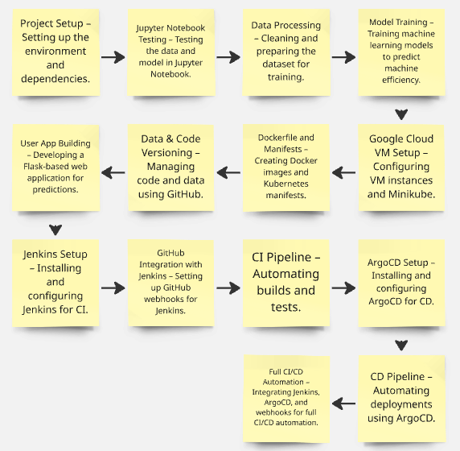

# Smart Manufacturing Machine Efficiency Prediction


## Dataset [Kaggle LINK](https://www.kaggle.com/datasets/ziya07/smart-manufacturing-iot-cloud-monitoring-dataset)

## Overview
This project predicts the efficiency of smart manufacturing machines using machine learning. It includes a Flask-based web application for user interaction and a CI/CD pipeline for deployment.

## Features
- **Machine Learning Model**: Predicts machine efficiency based on various input features.
- **Flask Web App**: User-friendly interface for predictions.
- **CI/CD Pipeline**: Automated build, test, and deployment using Jenkins, Docker, and ArgoCD.
- **Kubernetes Orchestration**: Manages containerized applications.


## Workflow
Below is the workflow for the project:



## How to Run the Project
1. **Clone the Repository**:
   ```bash
   git clone https://github.com/data-guru0/GITOPS-PROJECT-9.git
   cd GITOPS-PROJECT-9
   ```

2. **Set Up the Environment**:
   - Install dependencies using `setup.py`:
     ```bash
     python setup.py install
     ```

3. **Run the Flask App**:
   ```bash
   python application.py
   ```
   Access the app at `http://localhost:5000`.

4. **Build and Deploy with Docker**:
   - Build the Docker image:
     ```bash
     docker build -t smart-machine-efficiency .
     ```
   - Run the container:
     ```bash
     docker run -p 5000:5000 smart-machine-efficiency
     ```

5. **CI/CD Pipeline**:
   - Use the provided `Jenkinsfile` for automated builds and deployments.

## Input Features
The model uses the following features for predictions:
- Operation Mode
- Temperature (°C)
- Vibration (Hz)
- Power Consumption (kW)
- Network Latency (ms)
- Packet Loss (%)
- Quality Control Defect Rate (%)
- Production Speed (units/hr)
- Predictive Maintenance Score
- Error Rate (%)
- Date and Time (Year, Month, Day, Hour)

## Deployment
- **Kubernetes**: Use the provided manifests for deploying the app.
- **ArgoCD**: Sync the app with ArgoCD for continuous deployment.

## License
This project is licensed under the MIT License. See the [LICENSE](LICENSE) file for details.

## Contributing
Contributions are welcome! Please open an issue or submit a pull request.
